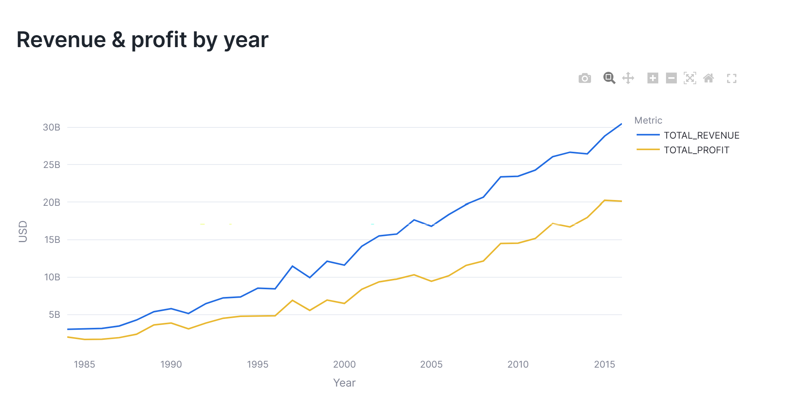
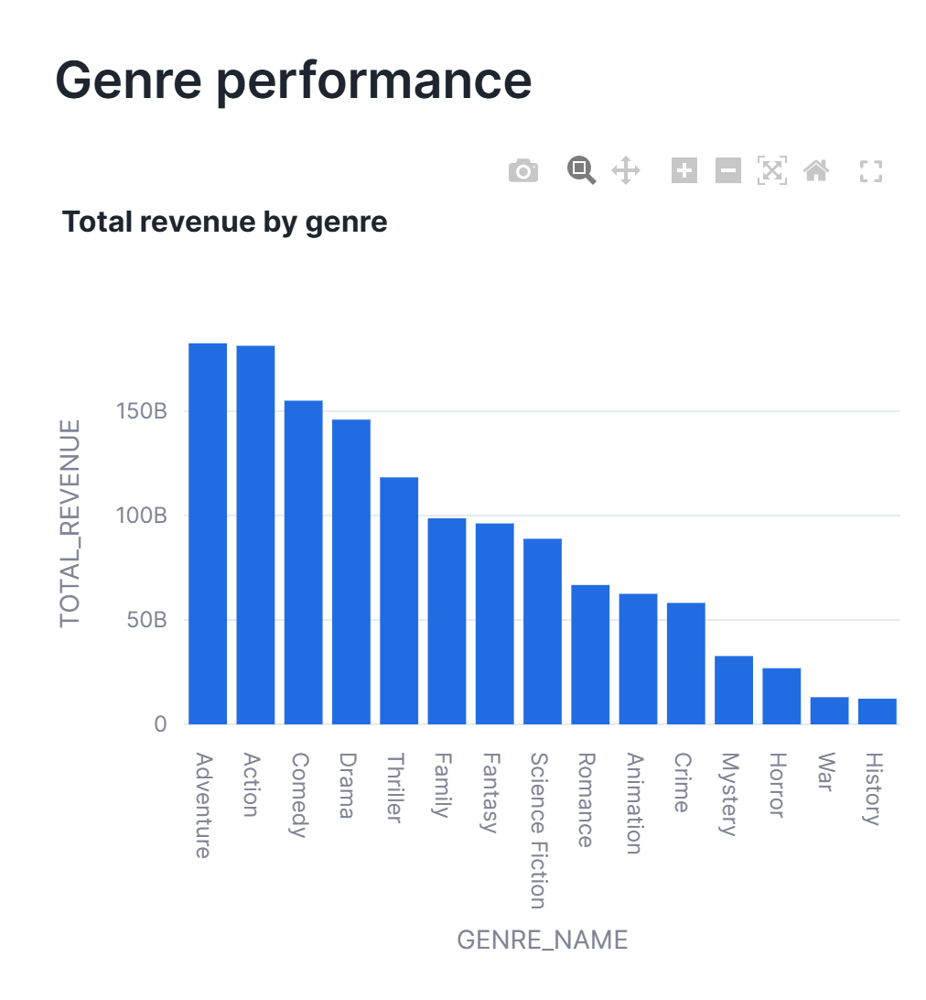
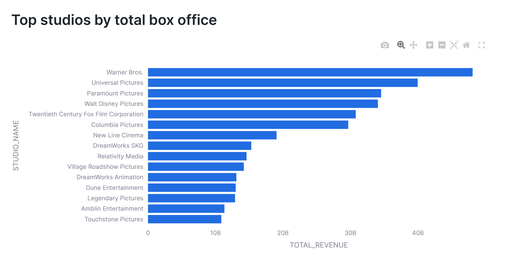
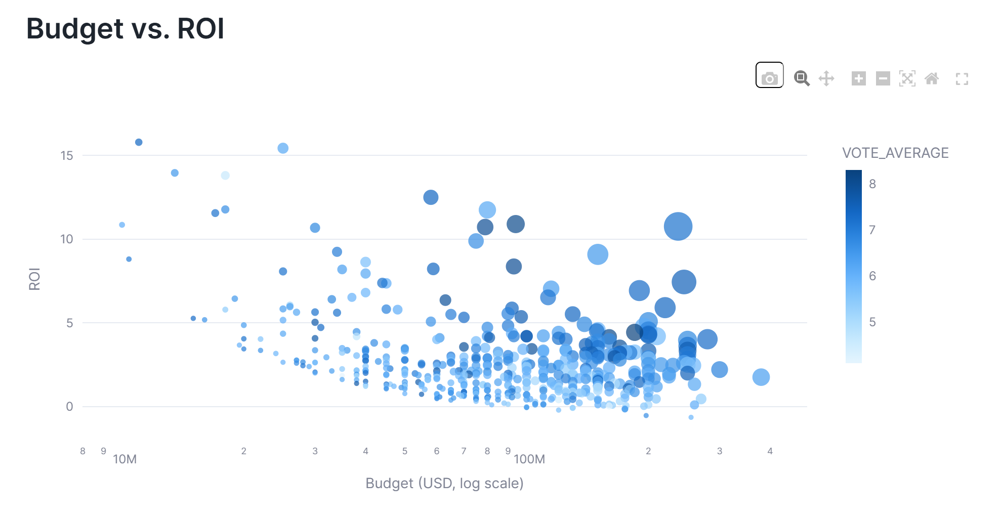
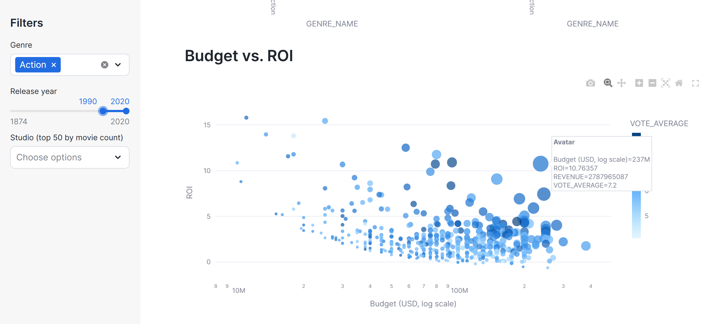

# Film Analytics

A box office / industry trends analytics app built using Snowflake, using
Streamlit-in-Snowflake for the frontend and a Kaggle movie dataset for the data.

## Architecture

```
Kaggle CSVs (movies_metadata.csv, credits.csv)
        |  upload once
        v
Snowflake Internal Stage  -->  COPY INTO raw tables
        |
        v
Transform layer (SQL)
  - Clean nulls, cast types, flatten JSON-like genre/company fields
  - Star schema: dim_genre, dim_studio, dim_release_date, fact_box_office
        |
        v
Streamlit-in-Snowflake app
  - Queries fact/dim tables via Snowpark
  - Filters: genre, year range, studio
  - Visuals: revenue trends, genre performance, budget vs ROI, top studios
```

## Demo Screenshots of Analytics









